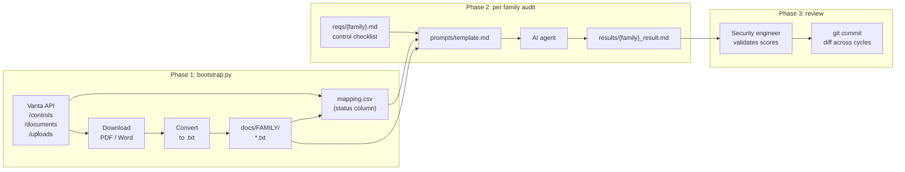

# We ran our ISO 27001 gap analysis with an AI agent. Here's the prompt pipeline.

Annual compliance audits are a known pain. 80+ controls, 200+ individual requirements,
policy documents scattered across a compliance tool, a wiki, and vendor portals. The
output is a spreadsheet with scores that are already stale by the time the auditor
closes the tab.

## The challenge

Our C5/ISO 27001 gap analysis covers 17 control families. For each control, an auditor
needs to locate the relevant policy document, read it, verify it covers the requirement,
and decide whether the evidence is current enough to count. At 1-2 engineers and several
weeks of wall time, it is one of the highest-cost recurring security activities we run.

The two failure modes we kept hitting:

1. **Evidence discovery** - knowing which documents cover which controls is manual institutional knowledge.
   Documents live in Vanta, Confluence, vendor portals, and shared drives. Finding them per-control takes the majority of the time.

2. **Staleness** - a document can be technically linked to a control in Vanta while being three years old and not actually covering the current requirement text. The tooling doesn't catch this.

## The approach

We built a three-phase pipeline: download first, audit second, review third.

Phase 1 is automation: a `bootstrap.py` script pulls all evidence from Vanta through
the API, converts PDFs and Word documents to plain text, and writes a `mapping.csv`
that indexes every piece of evidence with a `status` column (`ready` or `needs_manual_fetch`).

Phase 2 is prompt-driven: a single `template.md` prompt instructs an AI agent to read
the control checklist for a family, load the mapped evidence, and produce a scored gap
table. The agent runs per family, in parallel if needed.

Phase 3 is human: a security engineer reviews the AI-scored table, validates borderline
scores, and commits the result. Committed results diff cleanly across audit cycles.

The key constraint: the AI only scores what it can read. If evidence is not locally
available, the control gets `N/A` - not a guess, not a 0. This makes gaps explicit
rather than hidden in optimistic defaults.

## Architecture



## How it works

### The mapping.csv

The central artifact is a two-level evidence index:

```
family,control,source_type,link,status,doc_type
AM,,local_file,docs/AM/information-security-policy.txt,ready,documentation
AM,AM-03,local_file,docs/AM/asset-inventory-procedure.txt,ready,evidence
IDM,,confluence,https://yourorg.atlassian.net/wiki/spaces/SEC/pages/123456,needs_manual_fetch,documentation
BCM,,external_url,https://vendor.example.com/sla-doc,needs_manual_fetch,evidence
```

An empty `control` column means the evidence applies to all controls in the family.
A filled `control` column scopes it to one specific control. The agent uses both
when building its evidence set per control.

The `status` column does the heavy lifting:

- `ready` - file is locally available, audit proceeds
- `needs_manual_fetch` - URL-only record, the agent flags this control as `Incomplete` and scores it `N/A`

Before every audit run, one grep tells you exactly where you have gaps in coverage:

```bash
grep needs_manual_fetch audits/c5/mapping.csv
```

### The VantaAPIClient

The bootstrap talks to three Vanta endpoints per control: list documents, list uploaded
files per document, download the file. Rate limiting and cursor pagination are handled
transparently:

```python
def _paginate(self, endpoint: str) -> list[dict[str, Any]]:
    results = []
    cursor = None
    while True:
        params = {"pageSize": 100}
        if cursor:
            params["pageCursor"] = cursor
        data = self.make_api_request(endpoint, params)
        if "error" in data:
            break
        page_results = data.get("results", {})
        results.extend(page_results.get("data", []))
        page_info = page_results.get("pageInfo", {})
        if not page_info.get("hasNextPage", False):
            break
        cursor = page_info.get("endCursor")
    return results
```

PDF extraction uses `pypdf`. Word documents are recorded as `needs_manual_fetch` with
a placeholder, since reliable `.docx` to plain text conversion requires a dependency
heavier than the rest of the tool. That tradeoff is explicit in the code and surfaced
in `mapping.csv`.

### The prompt template

The audit prompt is a single Markdown file. The key design choice is that the **control
checklist is the ground truth**, not the evidence index. The agent must produce one row
per control in the req file, even if there is zero evidence:

```
For each control in the checklist:
1. Identify all relevant evidence rows from mapping.csv (family + control-specific).
2. Read the content of available evidence files.
3. Assess whether the evidence directly addresses the control requirement.
4. Score 0-10. Document gaps.
5. Assess evidence sufficiency: Yes / Partial / No / Incomplete.
```

The output table has five columns:

| Control | Evidence sources | Evidence sufficient? | Score (0-10) | Gaps |
|---------|-----------------|---------------------|--------------|------|
| AM-01 | information-security-policy.txt | Yes - current (2024) | 9/10 | Minor: no automated change logging |
| AM-04 | (needs_manual_fetch) | Incomplete | N/A | Fetch manually and re-run |
| AM-06 | (no evidence) | No | 0/10 | Link policy docs to this control in Vanta |

The "Evidence sufficient?" column forces the AI to reason about currency and completeness
separately from scoring. A document can exist and score 4/10 because it is outdated,
or score 8/10 for a specific control while being `Partial` because it doesn't cover
an edge case.

## Key decisions

**Download first, not live during audit.** The alternative is having the AI call the
Vanta MCP tool per control during the audit. We chose download-first because: (1) it
decouples audit runtime from API availability; (2) it creates a local snapshot for
comparing evidence state across audit cycles; (3) it makes the prompt deterministic -
the agent reads a known set of files rather than discovering evidence on the fly.

**`needs_manual_fetch` blocks scoring, not silently ignored.** An early version of the
prompt gave scores of 0 for URL-only controls. The problem: 0/10 looks the same as
"no policy exists" and triggers remediation work, when the actual state is "evidence
exists but is not locally available yet". Using `N/A` + `Incomplete` keeps the
distinction visible and makes audit completeness a first-class metric.

**AI scores as first pass, not final verdict.** The prompt explicitly instructs the
agent to flag borderline scores (4-7 range) as requiring human validation. Scores in
the 8-10 range where dates are not visible are flagged for recency check. The tool
produces a structured first draft that an engineer can verify in a few hours rather
than building from scratch in a few weeks.

## What you get out of it

A structured, committed gap analysis that you can diff. The first run surfaces evidence
gaps you didn't know you had (controls with zero documents linked in Vanta, URL-only
evidence for critical controls). Subsequent runs show what improved, what regressed,
and what was never remediated. The prompt pipeline stays the same; the evidence and
scores evolve with your security posture.

---

Full configuration reference: [compliance-audit/README.md](../compliance-audit/README.md)

---

How does your team handle evidence collection for compliance audits? Do you pull it
programmatically, maintain it manually, or accept the spreadsheet chaos and schedule
a sprint for it every year?
