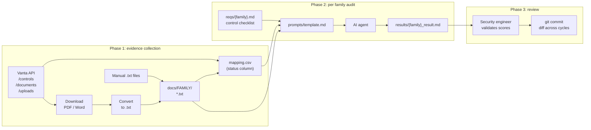

# How I automated a (C5/ISO 27001) compliance audit with an AI agent

Annual compliance audits are a known pain. 80+ controls, 200+ individual requirements,
policy documents scattered across a compliance tool, a wiki, and vendor portals. The
output is a spreadsheet with scores that are already stale by the time the auditor
closes the tab.

I built an agent that runs the whole gap analysis in minutes. Once the evidence is
indexed locally, the audit is a prompt — you can remediate a control, update the
document, and re-run without touching anything else. No re-reading the full framework.
No spreadsheet rebuild. Just the delta.

## The challenge

A single framework audit — C5 alone covers 17 control families — requires an auditor
to locate the relevant documents and evidence for each control, read them, verify they
cover the requirements, and decide whether the evidence is current enough to count.
At 1-2 engineers and several weeks of wall time, it was one of the highest-cost
recurring security activities on the team's calendar.

The two failure modes I kept running into:

1. **Evidence discovery** - knowing which documents cover which controls is manual institutional knowledge.
   Documents live in Vanta, Confluence, vendor portals, and shared drives. Finding them per-control takes the majority of the time.

2. **Staleness** - a document can be technically linked to a control in Vanta while being three years old and not actually covering the current requirement text. The tooling doesn't catch this.

## The approach

The pipeline has one hard requirement: evidence must be available as local text files. Everything else follows from that.

Downloading everything locally solves the discovery problem once — the mapping index tells the agent exactly which files cover which controls. The content-tier scoring catches staleness regardless of what the CSV says, because the agent reads the document and classifies it, not just checks that it exists.

Three phases: collect evidence first, audit second, review third. The AI only scores what it can read. If a file isn't locally available, the control gets `N/A` — not a guess, not a 0. This makes gaps explicit rather than hidden in optimistic defaults.

## Architecture


```mermaid
flowchart LR
    subgraph evidence ["Phase 1: evidence collection"]
        Manual["Manual .txt files"] --> DocsFolder
        VantaAPI["Vanta API\n/controls\n/documents\n/uploads"] --> Downloader["Download\nPDF / Word"]
        Downloader --> Converter["Convert\nto .txt"]
        Converter --> DocsFolder["docs/FAMILY/\n*.txt"]
        VantaAPI --> MappingGen["mapping.csv\n(status column)"]
        DocsFolder --> MappingGen
    end

    subgraph audit ["Phase 2: per family audit"]
        ReqFile["reqs/{family}.md\ncontrol checklist"] --> Prompt
        MappingGen --> Prompt["prompts/template.md"]
        DocsFolder --> Prompt
        Prompt --> Agent["AI agent"]
        Agent --> Result["results/{family}_result.md"]
    end

    subgraph review ["Phase 3: review"]
        Result --> Human["Security engineer\nvalidates scores"]
        Human --> Commit["git commit\ndiff across cycles"]
    end
```

## How it works

### The mapping.csv

The central artifact is a two-level evidence index. Every piece of evidence gets a row:
what family it belongs to, which specific control it covers (or blank for family-wide),
where the file lives, and whether it's locally available:

```
family,control,source_type,link,status,doc_type
AM,,local_file,docs/AM/information-security-policy.txt,ready,documentation
AM,AM-03,local_file,docs/AM/asset-inventory-procedure.txt,ready,evidence
IDM,,confluence,https://yourorg.atlassian.net/wiki/spaces/SEC/pages/123456,needs_manual_fetch,documentation
BCM,,external_url,https://vendor.example.com/sla-doc,needs_manual_fetch,evidence
```

An empty `control` column means the evidence applies to all controls in the family.
A filled `control` column scopes it to one specific control. The agent uses both
when building its evidence set per control.

The `status` column does the heavy lifting:

- `ready` - file is locally available, audit proceeds
- `needs_manual_fetch` - URL-only record, the agent flags this control as `Incomplete` and scores it `N/A`

Before every audit run, one grep tells you exactly where you have gaps in coverage:

```bash
grep needs_manual_fetch audits/c5/mapping.csv
```

### The prompt template

The audit prompt is a single Markdown file. The key design choice is that the **control
checklist is the ground truth**, not the evidence index. The agent must produce one row
per control in the req file, even if there is zero evidence.

Before scoring, the agent classifies each document into one of three content tiers by
reading it — not by trusting the `doc_type` field in the CSV:

| Content tier | What it looks like |
|---|---|
| **Policy** | States intent or commitments ("assets must be…", "the organisation shall…") |
| **Procedure / Standard** | Defines *how*: steps, configuration parameters, checklists |
| **Operational evidence** | Proves the control is *currently operating*: inventory exports, log excerpts, audit reports, dated test results |

The tier determines the scoring ceiling:

- Only policy-level content present → cap at 4/10
- Procedure/standard content but no operational evidence → cap at 6/10
- Operational evidence present → eligible for 7–10

A well-written policy that covers every requirement word-for-word is still capped at
4/10. Policy text states intent, not operational reality.

The output table has six columns:

| Control | Evidence sources | Content assessed as | Evidence sufficient? | Score (0-10) | Gaps |
|---------|-----------------|---------------------|---------------------|--------------|------|
| AM-01 | policy.md, inventory-export.csv | Operational evidence | Yes - current (2024) | 9/10 | Minor: no automated audit trail |
| AM-02 | policy.md, procedure.md | Procedure | Partial - no operational evidence | 6/10 | No operational evidence — implementation effectiveness unproven |
| AM-03 | policy.md | Policy only | No - intent stated, nothing more | 4/10 | No operational evidence — implementation effectiveness unproven |
| AM-04 | (needs_manual_fetch) | Unknown | Incomplete | N/A | Fetch manually and re-run |
| AM-06 | (no evidence) | None | No | 0/10 | Link evidence to this control |

The "Content assessed as" column separates what the document actually contains from what
the CSV claims it is. Any mismatch gets flagged in Gaps so the mapping can be corrected.

### Populating evidence from Vanta

The `mapping.csv` can be built manually — drop `.txt` files into `docs/{FAMILY}/` and
add rows. For teams with evidence already organized in Vanta, I wrote a `bootstrap.py`
script that automates it: it pulls all controls and linked documents from the Vanta API,
converts PDFs to plain text, and writes the mapping index in one pass.

Files that can't be downloaded — Confluence pages, external URLs, Word documents — are
recorded as `needs_manual_fetch` rather than skipped. The bootstrap knows they exist and
where to find them; it just can't read them programmatically.

For Confluence and Google Drive sources, there's a better path than manual download: if
your AI agent has the Confluence or Google Drive MCP configured, it fetches those
documents itself during the audit. The `source_type` field in the mapping tells the agent
which tool to call. Controls that were `N/A` because content wasn't local get scored
automatically — no extra step, no manual intervention. External URLs without an MCP
still require a manual fetch, but those are typically the minority.

## Key decisions

**Local files first, integrations second.** The pipeline has no runtime dependency on
Vanta, Confluence, or any external API. Evidence is downloaded once, stored locally,
and the audit runs against that snapshot. This decouples audit runtime from API
availability, creates a local record for comparing evidence state across cycles, and
makes the prompt deterministic — the agent reads a known set of files rather than
discovering evidence on the fly.

**`needs_manual_fetch` blocks scoring, not silently ignored.** An early version of the
prompt gave scores of 0 for URL-only controls. The problem: 0/10 looks the same as
"no policy exists" and triggers remediation work, when the actual state is "evidence
exists but is not locally available yet". Using `N/A` + `Incomplete` keeps the
distinction visible and makes audit completeness a first-class metric.

**AI scores as first pass, not final verdict.** The prompt explicitly instructs the
agent to flag borderline scores (4-7 range) as requiring human validation. Scores in
the 8-10 range where dates are not visible are flagged for recency check. The tool
produces a structured first draft that an engineer can verify in a few hours rather
than building from scratch in a few weeks.

## What you get out of it

The most immediate win is speed. What used to take 1-2 engineers several weeks now
runs in minutes. The agent reads every document, classifies it, and scores every control
while you're doing something else. The human review that follows is hours, not weeks —
focused on borderline scores and missing evidence rather than reading policy docs from
scratch.

The second win is re-runnability. Fix a gap, update the document, run the affected
family again. The rest of the scores stay untouched. You don't re-read the full
framework every time something changes — you only look at the delta.

The first full run is usually surprising. Controls you assumed were covered turn out to
have only a policy linked — no procedure, no operational evidence — and score 4/10
instead of the 8 someone had in the spreadsheet. Controls with URL-only evidence show
up as `N/A` rather than silently passing. You see the actual state of your posture,
not the optimistic version that lives in the compliance tool.

After that, the value compounds. Results are committed to git, so every subsequent cycle
shows exactly what improved, what regressed, and what was flagged months ago and never
remediated. The prompt stays the same; the evidence and scores evolve with your posture.

---

Full configuration reference: [compliance-audit/README.md](../compliance-audit/README.md)

---

How does your team handle evidence collection for compliance audits? Do you pull it
programmatically, maintain it manually, or accept the spreadsheet chaos and schedule
a sprint for it every year?
