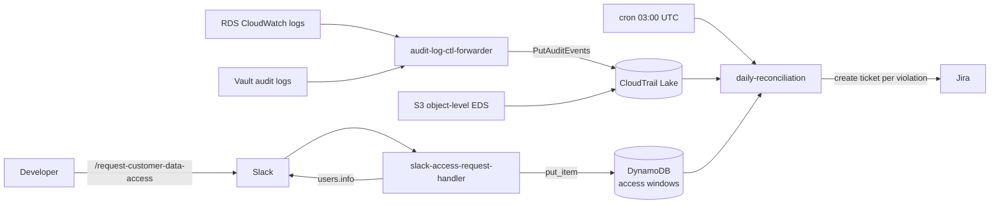

# Proving Every Production Data Access Was Justified

Slack modal -> DynamoDB -> CloudTrail Lake SQL -> Jira violation tickets. No third-party tool.

**Series**: Compliance without the theater (flagship)

**Module**: [cdaa/](../cdaa/)

---

## The compliance gap

C5 IDM-07 requires that every access to production customer data is authorized, justified, and traceable to a person. In practice this means three things: developers need a structured way to declare intent before touching production, the system needs to record what was actually accessed, and anything that doesn't match needs to surface automatically for the security team.

Without a structured process, developers access S3 buckets and databases for legitimate reasons — debugging, support, incident response — but no audit trail links the access to a reason or a time boundary. Manual CloudTrail log reviews are expensive and leave gaps.

The real challenge is the tension at the center: if you block access until it's approved, you slow down incident response. If you just log everything, the security team drowns in noise. The useful middle ground is frictionless declaration of intent combined with automated post-hoc detection of anything that didn't match.

## Approach

Three Lambdas, each owning a separate slice of the lifecycle. One handles the Slack modal and writes the approved access window to DynamoDB. One subscribes to CloudWatch log groups (RDS PostgreSQL, Vault audit) and forwards events to CloudTrail Lake. One runs nightly, queries CloudTrail Lake with SQL, correlates every event against DynamoDB windows, and creates Jira tickets for violations.

No approval step. No access blocking. The developer declares intent, accesses production, and the system catches anything outside the declared window the next morning.

The shape — trust now, audit later — is a deliberate trade-off against the "approve before access" pattern that most compliance tooling defaults to. More on that in the key decisions section.

## Architecture



**`slack-access-request-handler`** validates the Slack HMAC signature, opens a Block Kit modal collecting a Jira ticket ID, justification, and duration (15, 30, or 60 minutes). Slack payloads don't include user email by design, so the Lambda calls `users.info` with `users:read.email` to resolve it before writing the access window to DynamoDB:

```python
item = {
    "request_id": str(uuid.uuid4()),
    "user_email": resolved_email,       # resolved via Slack API, not from payload
    "jira_issue_id": jira_key,
    "justification": justification,
    "duration_minutes": minutes,
    "request_timestamp": now_iso,       # when the request was submitted
    "expiry_timestamp": expiry_iso,     # request_timestamp + duration_minutes
    "ttl": retention_ttl_epoch,         # 7-year C5 retention, not the access window
}
```

The TTL is set to the compliance retention period, not the access window. The access window lives in `request_timestamp` and `expiry_timestamp` and is used only by the reconciliation logic.

**`audit-log-ctl-forwarder`** subscribes to the RDS PostgreSQL and Vault audit CloudWatch log groups. It parses each line, drops noise (non-prod paths, unmonitored databases, unparseable lines), and forwards valid connection and credential-issuance events to a CloudTrail Lake custom ingestion channel via `cloudtrail-data:PutAuditEvents`. Database events land in a separate curated event data store, queryable alongside native S3 events using the same SQL interface.

**`daily-reconciliation`** runs at 03:00 UTC. It queries CloudTrail Lake for the previous day's events:

```sql
SELECT eventTime, eventName,
       userIdentity.principalId AS principalId,
       element_at(requestParameters, 'bucketName') AS reqBucketName,
       element_at(requestParameters, 'key')        AS reqObjectKey
FROM {event_data_store_id}
WHERE eventTime >= TIMESTAMP '2024-01-14 00:00:00'
  AND eventTime <= TIMESTAMP '2024-01-14 23:59:59'
  AND eventSource = 's3.amazonaws.com'
  AND eventName IN ('GetObject', 'PutObject', 'DeleteObject', 'RestoreObject')
```

Each event is correlated against DynamoDB windows using email as the primary key. The email extraction is the messiest part: for S3, the email is embedded in the SSO assumed role session name inside `principalId` (format: `AROAXXX:user@example.com`). For database events, Vault's `auth_display_name` carries the OIDC identity, linked back to the DB session via a `VaultCredsIssued` event ingested by the forwarder.

## The nuance most approval tools miss

Standard "approve before access" tools — Bytebase, Hoop.dev, and others — prevent unapproved access by blocking it. CDAA doesn't block anything, which means it has to handle a case those tools never see: the developer who accesses production first, then files the Slack request retroactively.

The window check is three lines:

```python
request_start_epoch = parse_time_to_epoch(req["timestamp"])
request_end_epoch = request_start_epoch + 60 * int(req["duration_minutes"])
access_within_window = request_start_epoch <= event_epoch <= request_end_epoch
```

An event before `request_start_epoch` fails the left-side bound. It produces an `ACCESS_OUTSIDE_WINDOW` violation — the same type as an event after the window expires. The system doesn't reward retroactive justification.

The full violation taxonomy:

| Situation | Violation type | Severity |
|---|---|---|
| No request at all | `UNAUTHORIZED_ACCESS` | High |
| Event before `request_timestamp` | `ACCESS_OUTSIDE_WINDOW` | Medium |
| Event after `request_timestamp + duration` | `ACCESS_OUTSIDE_WINDOW` | Medium |
| Unrecognized non-human actor | reported separately | varies |

The non-human path matters because Kubernetes service accounts, IAM roles, and AWS-managed services access the same S3 buckets. Known service actors are whitelisted by category (`SERVICE_PRINCIPAL`, `SERVICE_ACCOUNT`, `AWS_SERVICE`) and suppressed. Remaining unrecognized automated access is reported in a separate non-human group so it can be reviewed and either whitelisted or investigated without polluting the human violation queue.

## Key decisions

**No approval gate.** Blocking access until a request is approved would slow down incident response — exactly when developers most need quick access to understand what's happening in production. The accountability layer (a Jira ticket assigned to you if you access without a valid window) creates the right incentive without blocking legitimate emergency access.

**Daily reconciliation, not real-time.** CloudTrail Lake queries are pay-per-byte-scanned. A nightly batch over a full day of events is significantly cheaper than streaming correlation. C5 doesn't require real-time detection; the compliance evidence just needs to exist and be auditable. A one-day lag is acceptable and the batch approach is far simpler to operate.

**Email as the correlation key.** CloudTrail uses IAM identities. DynamoDB stores the email resolved from Slack at request time. Bridging those two requires extracting email from SSO session names, stripping Vault OIDC prefixes from `auth_display_name`, and falling back to IAM user `owner` tags for programmatic users. It's the most fragile coupling in the system, but it's also what makes the correlation reliable across S3, RDS, and Vault access paths without requiring a separate identity mapping service.

## What you get

The security team works a Jira queue instead of digging through CloudTrail logs. The audit trail is tamper-resistant: CloudTrail Lake records can't be deleted by the team being audited, and DynamoDB items carry a long-retention TTL set independently of the access window. Extending coverage to a new data store means adding a CloudWatch log subscription and a query against the curated event data store — the reconciliation core stays unchanged.
