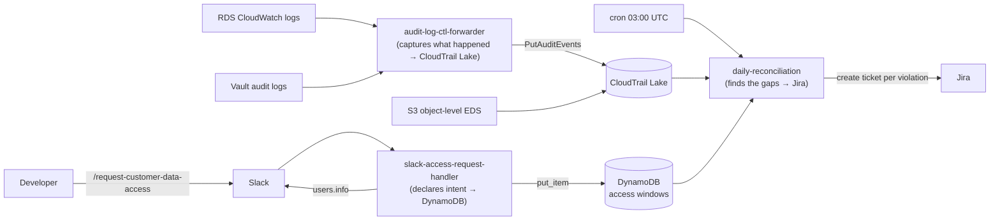

# Proving Every Production Data Access Was Justified

Slack modal -> DynamoDB -> CloudTrail Lake SQL -> Jira violation tickets. No third-party tool.

**Series**: Compliance without the theater (flagship)

**Module**: [cdaa/](../cdaa/)

---

## The problem

Your auditor asks: who accessed this customer record on March 14th, and why?

You open CloudTrail. You see an IAM role. You see a timestamp. You have no idea which person was behind it, no idea what they were trying to fix, and no ticket to point to. The access was almost certainly legitimate — a developer debugging a support escalation — but you can't prove it. That's a finding.

This is one of the most common gaps in production access controls, and it cuts across every major compliance framework:

| Framework | Control |
|---|---|
| SOC 2 | CC6.1, CC6.2 — logical access controls |
| ISO 27001:2022 | A.8.2, A.8.3 — privileged access management |
| GDPR | Art. 32 (technical measures) + Art. 30 (records of processing) |
| HIPAA | § 164.312(b) — audit controls |
| PCI DSS | Req. 10 — log and monitor all access to system components |
| NIST 800-53 / FedRAMP | AU-2, AU-3, AU-12 — audit events |
| BSI C5 | IDM-07 — authorization and traceability |

Every one of those has the same underlying requirement: access to production data must be authorized, justified, and traceable to a person. Most teams don't have a structured way to satisfy it.

## The real tension

The standard answer is "approve before access" — block the developer until someone clicks approve. Tools like Bytebase and Hoop.dev work this way.

The problem is that blocking is exactly the wrong behavior during an incident. The moment production is on fire and a developer needs to understand what's happening is precisely when a gated approval queue creates the most damage.

The useful middle ground is **frictionless declaration of intent + automated post-hoc detection**. The developer declares what they're about to do, accesses production, and the system catches anything that didn't match the next morning. No blocking. No slow path for incident response. Full audit trail. And critically: the system doesn't reward retroactive justification — if you access production first and file the Slack request after, that's still a violation.

## Approach

Three Lambdas, each owning a separate slice of the lifecycle. One handles the Slack modal and writes the approved access window to DynamoDB. One subscribes to CloudWatch log groups (RDS PostgreSQL, Vault audit) and forwards events to CloudTrail Lake. One runs nightly, queries CloudTrail Lake with SQL, correlates every event against DynamoDB windows, and creates Jira tickets for violations.

The shape — trust now, audit later — is deliberate. More on the trade-offs in the key decisions section.

## Architecture


```mermaid
flowchart LR
    Dev[Developer] -->|/request-customer-data-access| Slack
    Slack --> Handler["slack-access-request-handler\n(declares intent → DynamoDB)"]
    Handler -->|users.info| Slack
    Handler -->|put_item| DDB[(DynamoDB\naccess windows)]

    RDS[RDS CloudWatch logs] --> Forwarder["audit-log-ctl-forwarder\n(captures what happened → CloudTrail Lake)"]
    Vault[Vault audit logs] --> Forwarder
    Forwarder -->|PutAuditEvents| CTL[(CloudTrail Lake)]
    S3[S3 object-level EDS] --> CTL

    Cron[cron 03:00 UTC] --> Recon["daily-reconciliation\n(finds the gaps → Jira)"]
    CTL --> Recon
    DDB --> Recon
    Recon -->|create ticket per violation| Jira
```

**`slack-access-request-handler`** validates the Slack HMAC signature, opens a Block Kit modal collecting a Jira ticket ID, justification, and duration (15, 30, or 60 minutes). Slack payloads don't include user email by design, so the Lambda calls `users.info` with `users:read.email` to resolve it before writing the access window to DynamoDB:

```python
item = {
    "request_id": str(uuid.uuid4()),
    "user_email": resolved_email,       # resolved via Slack API, not from payload
    "jira_issue_id": jira_key,
    "justification": justification,
    "duration_minutes": minutes,
    "request_timestamp": now_iso,       # when the request was submitted
    "expiry_timestamp": expiry_iso,     # request_timestamp + duration_minutes
    "ttl": retention_ttl_epoch,         # 7-year retention period, not the access window
}
```

The TTL is set to the compliance retention period, not the access window. The access window lives in `request_timestamp` and `expiry_timestamp` and is used only by the reconciliation logic.

**`audit-log-ctl-forwarder`** subscribes to the RDS PostgreSQL and Vault audit CloudWatch log groups. It parses each line, drops noise (non-prod paths, unmonitored databases, unparseable lines), and forwards valid connection and credential-issuance events to a CloudTrail Lake custom ingestion channel via `cloudtrail-data:PutAuditEvents`. Database events land in a separate curated event data store, queryable alongside native S3 events using the same SQL interface.

**`daily-reconciliation`** runs at 03:00 UTC. It queries CloudTrail Lake for the previous day's events:

```sql
SELECT eventTime, eventName,
       userIdentity.principalId AS principalId,
       element_at(requestParameters, 'bucketName') AS reqBucketName,
       element_at(requestParameters, 'key')        AS reqObjectKey
FROM {event_data_store_id}
WHERE eventTime >= TIMESTAMP '2024-01-14 00:00:00'
  AND eventTime <= TIMESTAMP '2024-01-14 23:59:59'
  AND eventSource = 's3.amazonaws.com'
  AND eventName IN ('GetObject', 'PutObject', 'DeleteObject', 'RestoreObject')
```

Each event is correlated against DynamoDB windows using email as the primary key. The email extraction is the messiest part: for S3, the email is embedded in the SSO assumed role session name inside `principalId` (format: `AROAXXX:user@example.com`). For database events, Vault's `auth_display_name` carries the OIDC identity, linked back to the DB session via a `VaultCredsIssued` event ingested by the forwarder.

## The nuance most approval tools miss

Because CDAA doesn't block access, it has to handle a case that gating tools never see: the developer who accesses production first, then files the Slack request retroactively.

The window check is three lines:

```python
request_start_epoch = parse_time_to_epoch(req["timestamp"])
request_end_epoch = request_start_epoch + 60 * int(req["duration_minutes"])
access_within_window = request_start_epoch <= event_epoch <= request_end_epoch
```

An event before `request_start_epoch` fails the left-side bound. It produces an `ACCESS_OUTSIDE_WINDOW` violation — the same type as an event after the window expires. The system doesn't reward retroactive justification.

The full violation taxonomy:

| Situation | Violation type | Severity |
|---|---|---|
| No request at all | `UNAUTHORIZED_ACCESS` | High |
| Event before `request_timestamp` | `ACCESS_OUTSIDE_WINDOW` | Medium |
| Event after `request_timestamp + duration` | `ACCESS_OUTSIDE_WINDOW` | Medium |
| Unrecognized non-human actor | reported separately | varies |

The non-human path matters because Kubernetes service accounts, IAM roles, and AWS-managed services access the same S3 buckets. Known service actors are whitelisted by category (`SERVICE_PRINCIPAL`, `SERVICE_ACCOUNT`, `AWS_SERVICE`) and suppressed. Remaining unrecognized automated access is reported in a separate non-human group so it can be reviewed and either whitelisted or investigated without polluting the human violation queue.

## What a violation actually looks like

The first week the system ran, it surfaced three `ACCESS_OUTSIDE_WINDOW` tickets. Two were the same engineer accessing an S3 bucket twelve minutes after their declared window expired — they had extended the debugging session without filing a second request. One was a developer who had filed the Slack request thirty seconds *after* accessing the database, probably out of habit from older workflows.

None of those were malicious. All three were real compliance gaps. In the old world, none would have been caught. The engineer got a Jira ticket assigned to them, added a comment explaining what happened, and closed it. The audit trail now shows the access, the gap, and the resolution — which is exactly what an auditor wants to see.

## Key decisions

**No approval gate.** Blocking access until a request is approved would slow down incident response — exactly when developers most need quick access to understand what's happening in production. The accountability layer (a Jira ticket assigned to you if you access without a valid window) creates the right incentive without blocking legitimate emergency access.

**Daily reconciliation, not real-time.** CloudTrail Lake queries are pay-per-byte-scanned. A nightly batch over a full day of events is significantly cheaper than streaming correlation. The frameworks listed above don't require real-time detection; the compliance evidence just needs to exist and be auditable. A one-day lag is acceptable and the batch approach is far simpler to operate.

**Email as the correlation key.** CloudTrail uses IAM identities. DynamoDB stores the email resolved from Slack at request time. Bridging those two requires extracting email from SSO session names, stripping Vault OIDC prefixes from `auth_display_name`, and falling back to IAM user `owner` tags for programmatic users. It's the most fragile coupling in the system, but it's also what makes the correlation reliable across S3, RDS, and Vault access paths without requiring a separate identity mapping service.

## What you get

The security team works a Jira queue instead of digging through CloudTrail logs. The audit trail is tamper-resistant: CloudTrail Lake records can't be deleted by the team being audited, and DynamoDB items carry a long-retention TTL set independently of the access window. Extending coverage to a new data store means adding a CloudWatch log subscription and a query against the curated event data store — the reconciliation core stays unchanged.

---

For the full configuration reference, Terraform variable descriptions, and SSM secret setup, see the [module README](../cdaa/README.md).

---

How does your team handle production data access accountability? Do you gate it upfront, audit it after the fact, or something in between?
