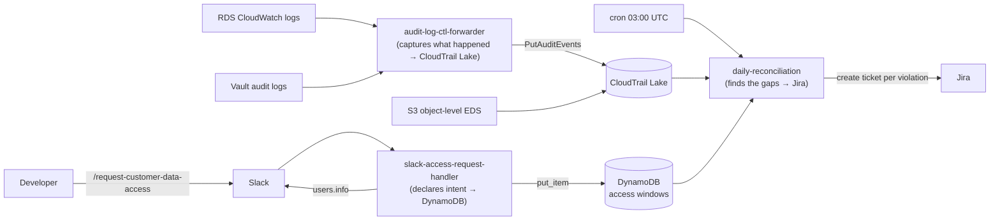

# Proving Every Production Data Access Was Justified

How to build a complete production data access audit trail — without blocking developers or buying a third-party tool.

---

## The problem

Your auditor asks: who accessed this customer record on March 14th, and why?

You open CloudTrail. You see an IAM role. You see a timestamp. You have no idea which person was behind it, no idea what they were trying to fix, and no ticket to point to. The access was almost certainly legitimate — a developer debugging a support escalation — but you can't prove it. That's a finding.

This is one of the most common gaps in production access controls, and it cuts across every major compliance framework:

| Framework | Control |
|---|---|
| SOC 2 | CC6.1, CC6.2 — logical access controls |
| ISO 27001:2022 | A.8.2, A.8.3 — privileged access management |
| GDPR | Art. 32 (technical measures) + Art. 30 (records of processing) |
| HIPAA | § 164.312(b) — audit controls |
| PCI DSS | Req. 10 — log and monitor all access to system components |
| NIST 800-53 / FedRAMP | AU-2, AU-3, AU-12 — audit events |
| BSI C5 | IDM-07 — authorization and traceability |

Every one of those has the same underlying requirement: access to production data must be authorized, justified, and traceable to a person. Most teams don't have a structured way to satisfy it.

## The real tension

The standard answer is "approve before access" — block the developer until someone clicks approve. Tools like Bytebase and Hoop.dev work this way.

The problem is that blocking is exactly the wrong behavior during an incident. The moment production is on fire and a developer needs to understand what's happening is precisely when a gated approval queue creates the most damage.

The useful middle ground is **frictionless declaration of intent + automated post-hoc detection**. The developer declares what they're about to do, accesses production, and the system catches anything that didn't match the next morning. No blocking. No slow path for incident response. Full audit trail.

## Approach

The system has three jobs: collect justifications, collect evidence, and reconcile the two — surfacing anything that doesn't match as a violation.

When a developer is about to touch production data, they file a Slack request — what they're doing, why, and for how long. That justification gets stored. Nothing is approved or blocked; the access happens regardless. In parallel, every data access across S3, RDS, and Vault is continuously captured into a central audit log.

Every night, the system reconciles the two sides: for every access event in the audit log, was there a matching justification on file? If yes, no action. If no — or if the access happened outside the declared time window — a Jira ticket is created for the security team to review.

The result is a complete, tamper-resistant record that answers the auditor's question: for every production data access, here is who did it, here is why they said they were doing it, and here is whether those two things matched.

## Architecture

```mermaid
flowchart LR
    Dev[Developer] -->|/request-customer-data-access| Slack
    Slack --> Handler["slack-access-request-handler\n(declares intent → DynamoDB)"]
    Handler -->|users.info| Slack
    Handler -->|put_item| DDB[(DynamoDB\naccess windows)]

    RDS[RDS CloudWatch logs] --> Forwarder["audit-log-ctl-forwarder\n(captures what happened → CloudTrail Lake)"]
    Vault[Vault audit logs] --> Forwarder
    Forwarder -->|PutAuditEvents| CTL[(CloudTrail Lake)]
    S3[S3 object-level EDS] --> CTL

    Cron[cron 03:00 UTC] --> Recon["daily-reconciliation\n(finds the gaps → Jira)"]
    CTL --> Recon
    DDB --> Recon
    Recon -->|create ticket per violation| Jira
```

The diagram shows the full flow. Walking through it from left to right:

**Storing justifications.** When a developer files a Slack request, the handler resolves their real identity — Slack payloads intentionally don't carry email, so it calls the Slack API — and writes a time-bounded record: who, why, which ticket, and for how long. Nothing is approved. Nothing is blocked.

**Collecting evidence.** CloudTrail Lake is the central audit store. S3 object-level events flow in natively. For everything else — currently RDS PostgreSQL and HashiCorp Vault — a forwarder Lambda subscribes to their CloudWatch log groups, parses each log line into a normalized event, and pushes it to CloudTrail Lake via a custom ingestion channel. Adding a new data source follows the same pattern: subscribe to its log stream, write a parser for its log format, and push normalized events. The reconciliation architecture stays unchanged, but the parser is new code for each source.

**Correlating the two sides.** The nightly job matches access events to justifications using email as the shared key. CloudTrail records IAM identities; the justification store holds emails resolved from Slack at request time. Bridging those two is the most fragile part of the system — the identity formats differ across S3, database, and Vault access paths — but it's what makes correlation work without a separate identity mapping service.

**Whitelisting non-human actors.** Kubernetes service accounts, IAM roles, and AWS-managed services access the same buckets and databases developers do. Known automated actors are categorized and suppressed so they don't flood the violation queue. Anything unrecognized is surfaced in a separate non-human group for review — so automated activity is never silently ignored, just handled separately from human access.

## The nuance most approval tools miss

Because CDAA doesn't block access, it has to handle a case that gating tools never see: the developer who accesses production first, then files the Slack request retroactively.

An access event is only valid if it falls strictly within the declared window — after the request was submitted and before the window expired. Access before the request timestamp is treated identically to access after expiry. The system doesn't reward retroactive justification.

The full violation taxonomy:

| Situation | Classification | Severity |
|---|---|---|
| No justification on file | Unauthorized access | High |
| Access before the request was submitted | Outside declared window | Medium |
| Access after the window expired | Outside declared window | Medium |
| Unrecognized automated actor | Reviewed separately | — |

The non-human path matters because IAM roles and AWS-managed services access the same S3 buckets and databases developers do. Known automated actors are whitelisted and suppressed. Anything unrecognized surfaces in a separate group for review — so automated activity is never silently ignored, just kept out of the human violation queue.

## What a violation actually looks like

The first week the system ran, it surfaced three `ACCESS_OUTSIDE_WINDOW` tickets. Two were the same engineer accessing an S3 bucket twelve minutes after their declared window expired — they had extended the debugging session without filing a second request. One was a developer who had filed the Slack request thirty seconds *after* accessing the database, probably out of habit from older workflows.

None of those were malicious. All three were real compliance gaps. In the old world, none would have been caught. The engineer got a Jira ticket assigned to them, added a comment explaining what happened, and closed it. The audit trail now shows the access, the gap, and the resolution — which is exactly what an auditor wants to see.

## Key decisions

**No approval gate.** Blocking access until a request is approved would slow down incident response — exactly when developers most need quick access to understand what's happening in production. The accountability layer (a Jira ticket assigned to you if you access without a valid window) creates the right incentive without blocking legitimate emergency access.

**Daily reconciliation, not real-time.** CloudTrail Lake queries are pay-per-byte-scanned. A nightly batch over a full day of events is significantly cheaper than streaming correlation. The frameworks listed above don't require real-time detection; the compliance evidence just needs to exist and be auditable. A one-day lag is acceptable and the batch approach is far simpler to operate.

## What you get

The security team works a Jira queue instead of digging through CloudTrail logs. Each violation ticket carries the full context needed to review it without going back to the logs: who triggered it, what they accessed and when, whether a justification was on file, what window was declared, and the exact mismatch. The audit records are retained for the compliance retention period independently of the access window, and CloudTrail Lake records can't be deleted by the team being audited.

Current coverage: S3 object-level access, RDS PostgreSQL connections, and HashiCorp Vault credential issuance. Kubernetes pod-level access is not covered — workload identity correlation would require a separate ingestion path. Extending to a new data store means writing a parser for its log format, wiring in a new CloudWatch subscription, and potentially updating the reconciliation queries — the correlation architecture stays the same, but it's not plug-and-play.

---

For the full configuration reference, Terraform variable descriptions, and SSM secret setup, see the [module README](../cdaa/README.md). Part of the [Compliance engineering](../) series.

---

How does your team handle production data access accountability? Do you gate it upfront, audit it after the fact, or something in between?
