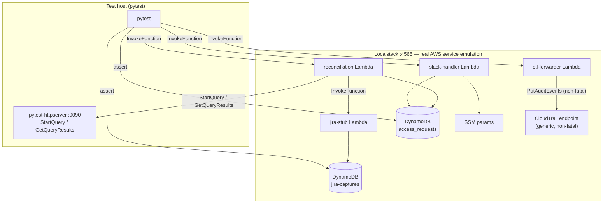

# Customer Data Access Audit (CDAA)

> Blog post: [blog-posts/post-03-cdaa.md](../blog-posts/post-03-cdaa.md)

Automated audit trail for every production customer data access. Covers C5 controls IDM-07, IDM-01, IDM-02, IDM-05, OPS-10, OPS-15.

## Overview

### Requirements

C5 compliance (IDM-07) requires that every access to production customer data is authorized, justified, and traceable to a person. Without a structured process, developers access S3 buckets and databases for legitimate reasons — debugging, support, incident response — but no audit trail links the access to a reason or a time boundary. Manual CloudTrail log reviews are not scalable and leave room for gaps.

The system needs to:

- Give developers a frictionless way to declare intent before accessing production data
- Record a tamper-resistant log of what was actually accessed and when
- Automatically detect access that happened without a prior request, outside the approved window, or beyond the approved duration
- Produce actionable output for the security team without requiring them to query logs

### Solution

Any developer who needs to inspect production customer data simply types `/request-customer-data-access` in Slack. A modal asks for a Jira ticket, a justification, and how long access is needed (15, 30, or 60 minutes). That's it — no approval step, no waiting. The request is recorded and the developer can proceed.

Every night the system reconciles what was actually accessed in S3 and in the databases against what was requested. Access that falls within an approved window leaves no trace. Anything outside that — no request at all, access before the request was submitted, or access after the window expired — becomes a violation. A Jira ticket is opened automatically and assigned to the person responsible. The security team does not need to dig through logs; they just work the Jira queue.

Automated service access (Kubernetes workloads, IAM roles, AWS-managed services) is handled separately. Known service actors are whitelisted and suppressed. Any unrecognised non-human access is reported as a distinct group so it can be reviewed and either whitelisted or investigated.

The system audits and reports. It does not block access and does not require any manual approval.

## Use cases

**Proper access request** — developer requests access before touching production data, provides a Jira ticket and justification. Reconciliation finds the approved window: no violation, no ticket.

**Unauthorized access** — developer accesses S3 or a database with no prior request. Reconciliation detects the gap, creates an `UNAUTHORIZED_ACCESS` violation, and opens a Jira ticket assigned to them.

**Access after window expires** — developer requested 15 minutes but kept accessing data beyond that. Events outside the window produce an `ACCESS_OUTSIDE_WINDOW` violation.

**Pre-request access** — developer accesses data first, then files the Slack request retroactively. Events before the request timestamp are treated as `ACCESS_OUTSIDE_WINDOW`.

**Automated service access** — Kubernetes service accounts, IAM roles, and AWS-managed services access the same resources. Whitelisted actors are suppressed. Remaining unrecognised service access is reported as non-human violations, separate from human violations.

## Design

Three event-driven Lambda functions own separate slices of the lifecycle:

**`slack-access-request-handler`** — receives the Slack slash command, validates the HMAC signature, opens a modal to collect a Jira ticket ID, justification, and duration. Resolves the user's email via the Slack API (`users:read.email`) and writes the approved access window to DynamoDB with a TTL for retention.

**`audit-log-ctl-forwarder`** — subscribed to the RDS PostgreSQL and Vault audit CloudWatch log groups. Parses each line, drops noise (non-prod paths, unmonitored databases, unparseable lines), and forwards valid connection and credential-issuance events to a CloudTrail Lake custom ingestion channel via `cloudtrail-data:PutAuditEvents`.

**`daily-reconciliation`** — runs on a cron (default 03:00 UTC). Queries CloudTrail Lake for the previous day's S3 object-level events (native EDS) and database/Vault events (curated EDS). Correlates each event against DynamoDB access windows using email as the primary correlation key. Classifies actors, applies whitelists, generates a structured JSON report, and creates Jira tickets per violation via a configurable connector Lambda.

## Configuration

### Required

| Variable | Description |
|---|---|
| `name_prefix` | Prefix for all resource names |
| `account_id` | AWS account ID |
| `jira_project_key` | Jira project key for violation tickets |
| `customer_data_config` | JSON listing resources to monitor: `{"s3_buckets":[...], "rds_databases":[...]}`. Optional keys: `s3_prefixes` (cost scoping) and `db_arn_map` (DB name → RDS ARN) |
| `rds_postgresql_loggroup_name` | CloudWatch log group for RDS PostgreSQL logs |
| `vault_audit_loggroup_name` | CloudWatch log group for Vault audit logs |

### Key optional

| Variable | Default | Description |
|---|---|---|
| `jira_connector_function_name` | `null` | Lambda that creates Jira tickets. Enable with SSM flag `jira_reporting_enabled` |
| `allowed_durations` | `[15, 30, 60]` | Allowed access window sizes in minutes |
| `database_audit_filter` | `""` | Comma-separated DB names to monitor; empty = all |
| `whitelist_db_users` | `[]` | DB service usernames excluded from audit (e.g. migration users) |
| `whitelist_s3_actors` | `{}` | S3 automated actors excluded by category: `SERVICE_PRINCIPAL`, `SERVICE_ACCOUNT`, `AWS_SERVICE` |
| `local_timezone` | `Europe/Berlin` | Timezone for reconciliation time windows |
| `cloudtrail_lake_retention_period_days` | `365` | Set to `2555` for 7-year C5 retention |
| `daily_reconciliation_cron` | `cron(0 3 * * ? *)` | When reconciliation runs |

### SSM secrets (set manually post-apply)

Terraform creates placeholder values with `ignore_changes`. Update them in SSM after the first apply:

- `/<prefix>/slack_signing_secret` (SecureString)
- `/<prefix>/slack_bot_token` (SecureString)

### Feature flag

- `/<prefix>/jira_reporting_enabled` — defaults to `false`. Set to `true` to enable Jira ticket creation.

## Testing

### Prerequisites

- Docker (Docker Desktop on Mac/Windows, or Docker Engine + bridge gateway IP on Linux)
- [uv](https://github.com/astral-sh/uv) for Python dependency management
- AWS CLI (credentials are dummy values for localstack; no real account needed)

### Start localstack

From the `cdaa/` directory:

```bash
docker compose up -d
```

Localstack exposes port `4566`. The Lambda executor uses the Docker socket to run Lambda containers in Docker-in-Docker mode, so the socket must be mounted (see `docker-compose.yml`).

### Apply Terraform

```bash
cd terraform
terraform init        # first time only
make apply            # applies against localstack using terraform.tfvars.localstack
```

`make apply` is scoped with `-target` flags to the resources the tests need: the DynamoDB table, all three Lambdas, the IAM role, and the SSM parameters. CloudTrail Lake and CloudWatch resources are skipped because localstack community does not support them.

### Run integration tests

```bash
cd tests
uv run pytest test_integration.py -v
```

**Linux only:** the `pytest-httpserver` mock servers run on the test host but must be reachable from inside Lambda Docker containers. Set `CTL_HTTPSERVER_HOST` to the Docker bridge gateway before running:

```bash
export CTL_HTTPSERVER_HOST=$(ip route show default | awk '/default/{print $3}')
uv run pytest test_integration.py -v
```

### Run unit tests

Unit tests do not require localstack or any AWS connectivity:

```bash
cd tests
uv run pytest unit/ -v
```

### Mock strategy



API Gateway and CloudWatch log triggers are not exercised — tests invoke Lambdas directly via `lambda:InvokeFunction`. The real Slack API and real Jira API are never called.

| Component | Approach |
|---|---|
| DynamoDB | Real table deployed to localstack |
| SSM Parameter Store | Real parameters deployed to localstack; fixtures overwrite values for tests |
| Lambda invocations | Real Lambdas deployed to localstack, invoked via `lambda:InvokeFunction` |
| CloudTrail `PutAuditEvents` | Localstack's generic CloudTrail endpoint is called; failures are non-fatal (caught by the Lambda's own error handling). Tests assert on invocation success and DynamoDB state, not on CTL write. |
| CloudTrail Lake queries (`StartQuery` / `GetQueryResults`) | `pytest-httpserver` runs on the test host (port 9090). The reconciliation Lambda's `AWS_ENDPOINT_URL_CLOUDTRAIL` is dynamically set to route boto3 calls to the mock server. |
| Jira connector | A stub Lambda (`cdaa-test-jira-stub`) is deployed to localstack. It writes each invocation payload to a DynamoDB capture table (`cdaa-test-jira-captures`). Tests read that table to assert what the reconciliation Lambda sent. |
